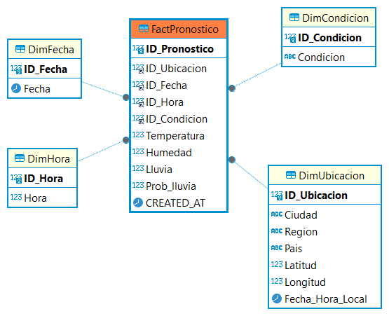

# Proyecto de Automatización de Pronóstico del Tiempo

## Descripción

Este proyecto tiene como objetivo automatizar la actualización de los pronósticos del tiempo. Para ello, se utilizan scripts en Python para realizar el proceso ETL del pipeline. Los datos se ingestan a través de un API de condiciones meteorológicas, para su posterior análisis y procesamiento. El proceso se ejecuta de manera automatizada dos veces al día.

La solución emplea Python y GitHub Actions para la ejecución automática del flujo de trabajo. Los datos actualizados se almacenan en una base de datos MySQL tipo OLAP con un esquema Estrella. Los datos se visualizan en un dashboard de Looker Studio.

## Tecnologías

- **Python 3.x**: Lenguaje principal para la manipulación y procesamiento de datos meteorológicos.
- **GitHub Actions**: Para la automatización de la ejecución a través de cron jobs.
- **MySQL / Base de Datos**: Para almacenar y gestionar los datos de los pronósticos.
- **API Meteorológica**: Para obtener los datos actualizados del pronóstico del tiempo.
- **Looker Studio**: Para la visualización de los datos en Looker Studio.

## Funcionalidades

- **Configuración del ambiente donde corre la aplicación**: Para ejecutar la aplicación, se utiliza el entorno de GitHub Actions, basado en un servidor Ubuntu. El archivo etl.yaml, que contiene todas las instrucciones de ejecución, se encuentra en el directorio .github/workflows/etl.yaml.

- **Ejecución de los archivos**: Los scripts de Python se ejecutan automáticamente dentro del entorno de GitHub Actions. El flujo de ejecución de los archivos es el siguiente: extract.py → processed.py → modelo_datos.py → load.py.

- **Ingesta de datos**:  Los datos se obtienen a través de la API meteorológica de https://www.weatherapi.com/.

- **Proceso de los datos**: Los datos se van almacenado en carpeta por niveles hasta llegar a una bas de datos

- **Carga de datos en la base de datos**: Los datos se almacenan en una base de datos MySQL

- **Visualización de datos**: Los datos se visualizan en un dashboard de Looker Studio, el cual está conectado a la base de datos.

## Gráficos que complementan la explicación del proyecto:
### Diseño de la arquitectura del flujo de los datos.

### Diseño del modelado de  los datos OLAP esquema Estrella.

## Diseño del dashboard de Looker Studio (En Constrcción).

## Nota: Todas las variables de entorno(secretos, credenciales, api_key) están guardadas en el Environment secrets en github.
